<div align="center">



# 📊 Awesome Workforce Analytics Platform 🚀

<a href="https://github.com/ishandutta2007/Awesome-Awesome-Awesome"></a><a href="https://discord.gg/jc4xtF58Ve"></a>
[](https://opensource.org/licenses/MIT)
[](https://github.com/ishandutta2007/Awesome-Workforce-Analytics-Platform/pulls)
[](https://github.com/ishandutta2007/Awesome-Workforce-Analytics-Platform/graphs/commit-activity)
[](https://github.com/ishandutta2007/Awesome-Workforce-Analytics-Platform/stargazers)
<a href="https://github.com/ishandutta2007"></a>

<p align="center">
  <b>A curated catalog of enterprise SaaS platforms, open-source business intelligence engines, HR analytics repositories, and machine-learning frameworks for Workforce Intelligence, People Analytics, Headcount Planning &amp; Organizational Insights.</b>
</p>

<sub>Last updated: August 2026 • Curated for HR Tech Leaders, People Scientists, Workforce Planners, and BI Engineers</sub>

</div>

---

## 📑 Table of Contents

- [🌟 Overview &amp; Ecosystem](#-overview--ecosystem)
- [🏢 Enterprise SaaS &amp; Hosted Platforms](#-enterprise-saas--hosted-platforms)
- [💻 Open-Source Repositories &amp; Frameworks](#-open-source-repositories--frameworks)
- [🛠️ Additional Data Science &amp; Pipeline Tools](#️-additional-data-science--pipeline-tools)
- [🏗️ Self-Hosted Workforce Analytics Architecture](#️-self-hosted-workforce-analytics-architecture)
- [📈 Star History](#-star-history)
- [🤝 How to Contribute](#-how-to-contribute)
- [⚖️ Disclaimer &amp; Ethics](#️-disclaimer--ethics)

---

## 🌟 Overview &amp; Ecosystem

**Workforce Analytics Platforms** (also known as **People Analytics** or **Talent Intelligence Platforms**) empower organizations to measure, forecast, and optimize their human capital operations. These platforms integrate disparate data streams across HRIS, ATS, LMS, payroll, engagement surveys, and productivity telemetry to deliver actionable insights on:

- 👥 **Headcount &amp; Capacity Modeling**: Budgeting, dynamic organizational charts, and hiring velocity.
- 📉 **Attrition &amp; Retention Analytics**: Survival analysis, flight-risk modeling, and stay-driver scoring.
- 💰 **Compensation &amp; Equity Parity**: Market benchmarks, gender pay equity audits, and total rewards optimization.
- 🎯 **Skills &amp; Internal Talent Mobility**: Skill gap taxonomy, automated gig matching, and succession planning.
- 💬 **Employee Voice &amp; Sentiment**: NLP pulse surveys, lifecycle feedback, and driver-tree diagnostics.
- 🌐 **Organizational Network Analysis (ONA)**: Cross-functional collaboration graphs and manager span-of-control.

---

## 🏢 Enterprise SaaS &amp; Hosted Platforms

The following enterprise platforms are sorted descending by **Company Scale (Market Cap / Valuation / Revenue)**. Specific entry-tier pricing and free trial / free tier limits are detailed below:

| Platform | Company Scale (Valuation / Revenue) | Description | Starting Pricing | Free Tier / Free Trial Limits |
| :--- | :--- | :--- | :--- | :--- |
| **[Microsoft Power BI](https://powerbi.microsoft.com/)** | **$3.10 Trillion** (Market Cap) / $245B Rev | Business intelligence platform widely used for HR and workforce analytics dashboards, attrition modeling, and headcount reporting. | $14.00 / user/month (Power BI Pro, annual commitment; Premium Per User at $24.00/user/month) | Free Forever tier (Power BI Desktop + 10 GB cloud workspace limit for personal authoring/viewing, no sharing); 60-day free trial of Power BI Pro |
| **[Oracle Fusion HCM Analytics](https://www.oracle.com/applications/human-capital-management/hcm-analytics/)** | **$380 Billion** (Market Cap) / $53B Rev | Workforce analytics built around Oracle Fusion Cloud HCM data, providing HR dashboards and predictive talent metrics. | $15.00 / employee/month (or entry cloud analytics contracts from ~$15,000/year) | 30-day Oracle Cloud Free Trial with $300 in free cloud credits + Always Free cloud tier access |
| **[Tableau](https://www.tableau.com/)** | **$280 Billion** (Salesforce Market Cap) / $35B Rev | Business intelligence and visualization platform deployed for people analytics, HR reporting, and org analysis. | $75.00 / user/month (Creator tier, billed annually; Explorer at $42/user/month, Viewer at $15/user/month) | 14-day free trial of Tableau Cloud/Desktop with full analytics features; Tableau Public is free forever (public publishing only) |
| **[SAP SuccessFactors People Analytics](https://www.sap.com/products/hcm/people-analytics.html)** | **$260 Billion** (Market Cap) / $36B Rev | Enterprise people analytics integrated with SAP SuccessFactors for workforce reporting, HR metrics, and dashboards. | $6.00 / employee/month (part of core SuccessFactors suite, up to $38 PEPM for full modules) | 30-day free trial on SAP Cloud with pre-configured demo environment and sample workforce datasets |
| **[IBM Planning Analytics](https://www.ibm.com/products/planning-analytics)** | **$200 Billion** (Market Cap) / $62B Rev | Enterprise planning and analytics platform supporting workforce budgeting, headcount, and scenario planning. | $825.00 / instance/month (plus ~$79.50/user/month for additional authorized users) | 30-day free trial of IBM Planning Analytics on Cloud with preloaded sample models and guided tutorials |
| **[ADP DataCloud](https://www.adp.com/)** | **$115 Billion** (Market Cap) / $19B Rev | Workforce analytics and benchmarking capabilities built around ADP payroll and HR data. | $15.00 / employee/month (entry HR/payroll bundle + DataCloud reporting tier) | 30-day guided trial / interactive sandbox environment through the ADP Marketplace |
| **[Workday Prism Analytics](https://www.workday.com/)** | **$70 Billion** (Market Cap) / $7.3B Rev | Data analytics capability within the Workday ecosystem for blending Workday and external workforce/business data. | ~$30,000 / year (typically priced as an add-on at ~40% of core Workday license) | 30-day guided proof-of-concept sandbox trial for existing Workday enterprise customers |
| **[Deloitte Workforce Analytics](https://www.deloitte.com/)** | **$67.2 Billion** (Annual Revenue) | Enterprise workforce analytics advisory and consulting platform covering people data, strategy, and planning. | $50,000 / project engagement | 30-day free trial for Deloitte Accounting Research Tool (DART); free virtual workforce experience simulations |
| **[UKG Pro Workforce Management](https://www.ukg.com/)** | **$35 Billion** (Valuation) / $2.5B+ Rev | Workforce management platform providing scheduling, time, attendance, labor analytics, and operational insights. | $26.00 / employee/month (entry bundle; up to $41 PEPM for full talent/workforce suite) | Guided interactive sandbox demo via UKG Demo Center with simulated workforce scenarios (no self-service free trial) |
| **[Peakon by Workday](https://www.workday.com/)** | **$20 Billion+** (Workday Suite / $700M Acq) | Employee listening and engagement analytics platform integrated into the Workday ecosystem. | $3.50 / employee/month (billed annually; enterprise tier starts at ~$20,000/year) | 30-day guided proof-of-concept sandbox trial with sample survey data for enterprise prospects |
| **[Qualtrics Employee Experience](https://www.qualtrics.com/employee-experience/)** | **$12.5 Billion** (Acquisition Valuation) | Employee experience platform with analytics for engagement, sentiment, employee lifecycle, and workforce trends. | $20,000 / year (entry EmployeeXM enterprise license) | Free Forever tier for Core XM (limited to 3 active surveys, 30 questions/survey, and 500 responses); 30-day free trial for advanced XM |
| **[Anaplan Workforce Planning](https://www.anaplan.com/)** | **$10.7 Billion** (Acquisition Valuation) | Connected planning platform used for workforce planning, headcount modeling, compensation, and scenario analysis. | $30,000 / year (standard planning capacity tier) | 30-day guided sandbox trial with interactive headcount modeling templates upon sales consultation |
| **[Qlik](https://www.qlik.com/)** | **$10.0 Billion** (Valuation) / $1B+ Rev | Analytics and data integration platform for workforce dashboards, HR reporting, and interactive people analytics. | $300.00 / month (Starter cloud tier; Standard analytics at ~$825/month for up to 20 users) | 30-day free trial of Qlik Cloud supporting up to 5 GB of data in memory and up to 5 users |
| **[Alight People Analytics](https://www.alight.com/)** | **$4.5 Billion** (Market Cap) / $3.4B Rev | Workforce and employee analytics capabilities covering HR data, employee experience, and workforce trends. | $4.00 / employee/month (annual enterprise contracts start from ~$25,000/year) | 30-day guided pilot / interactive demonstration sandbox with synthetic HR records upon enterprise inquiry |
| **[People Analytics by Lattice](https://lattice.com/)** | **$3.0 Billion** (Valuation) | People management platform providing analytics around employee performance, engagement, and compensation. | $11.00 / user/month ($4,000/year minimum contract; analytics/engagement add-on at $4/user/month) | Interactive self-paced product tour with preloaded workforce engagement and performance data (no self-service free trial) |
| **[Eightfold AI](https://eightfold.ai/)** | **$2.1 Billion** (Valuation) | AI-powered talent intelligence platform covering skills, workforce planning, talent acquisition, and mobility. | $7.00 / employee/month (typical base enterprise agreements start from ~$40,000/year) | 30-day guided proof-of-concept sandbox environment with synthetic talent dataset upon enterprise evaluation |
| **[Culture Amp](https://www.cultureamp.com/)** | **$1.5 Billion** (Valuation) | Employee experience and people analytics platform focused on engagement, performance, and retention insights. | $9.00 / employee/month (billed annually, depending on module bundle) | Custom guided sandbox demo environment with preloaded employee sentiment and turnover data (no self-service free trial) |
| **[Visier](https://www.visier.com/)** | **$1.0 Billion** (Valuation) | Workforce intelligence and people analytics platform covering workforce planning, retention, talent, productivity, and AI insights. | $50,000 / year (or ~$2–$5 per employee/month) | 30-day free trial sandbox with pre-built HR metrics and sample datasets (no credit card required) |
| **[Visier People](https://www.visier.com/products/people-analytics/)** | **$1.0 Billion** (Valuation) | Dedicated people analytics environment providing workforce metrics, employee lifecycle, and retention insights. | $50,000 / year (or ~$2–$5 per employee/month for mid-market) | 30-day free trial sandbox with full access to standard HR metrics, pre-built dashboards, and benchmark datasets |
| **[Gloat](https://gloat.com/)** | **$1.0 Billion** (Valuation) | Talent marketplace and workforce intelligence platform focused on skills, internal mobility, and workforce planning. | $5.00 / employee/month (annual enterprise contracts typically start from ~$35,000/year) | 30-day customized proof-of-concept sandbox trial with talent matching demo upon sales consultation |
| **[Lightcast](https://lightcast.io/)** | **$1.0+ Billion** (Valuation) / ~$100M ARR | Workforce and labor-market intelligence platform providing skills, jobs, talent supply-demand, and salary analytics. | $5,000 / year (entry labor-market dataset module) | 14-day free trial data sample access via Snowflake Marketplace; free labor-market query consultation |
| **[ChartHop](https://www.charthop.com/)** | **$335 Million** (Valuation) | People analytics and organizational management platform combining org charts, compensation, and headcount planning. | $8 / employee/month ($9,000/year minimum contract; additional modules from $4 PEPM) | 14-day free trial with access to core org chart, visualization, and basic people directory features |
| **[One Model](https://www.onemodel.co/)** | **$150 Million** (Valuation) | People analytics and workforce planning platform providing a unified workforce data model and predictive capabilities. | $30,000 / year (base analytics tier) | 30-day guided proof-of-concept sandbox trial with custom data connector testing on request |
| **[Fuel50](https://fuel50.com/)** | **$120 Million** (Valuation) | Talent marketplace and career mobility platform using workforce and skills analytics to support internal mobility. | $4.00 / employee/month (annual enterprise contracts start from ~$25,000/year) | 30-day guided sandbox trial with pre-configured career pathing and skills benchmarking upon request |
| **[Crunchr](https://www.crunchr.com/)** | **$50 Million+** (Valuation) | People analytics platform focused on workforce data, HR dashboards, organizational insights, and workforce planning. | $20,000 / year (or ~$3–$6 per employee/month) | 14-day guided proof-of-concept (PoC) sandbox trial with sample workforce data upon sales request |
| **[Dataroots / Workforce Analytics Solutions](https://dataroots.io/)** | **$20 Million+** (Valuation) | Data science and analytics capabilities for workforce forecasting, employee analytics, and predictive modeling. | €1,500 / month (~$1,650/month base managed analytics tier) | 7-day free trial for software and analytics platform capabilities with a 30-minute onboarding call |

---

## 💻 Open-Source Repositories &amp; Frameworks

The following open-source projects can be utilized to build, customize, and self-host end-to-end workforce intelligence platforms. Repositories are sorted in descending order by **GitHub Star Count**:

- **[Grafana](https://github.com/grafana/grafana)** [](https://github.com/grafana/grafana/stargazers)  
  ⚡ *76,000+ stars* • Leading open-source observability and visualization platform used to build real-time workforce KPI dashboards from SQL databases, APIs, and talent pipelines.

- **[Apache Superset](https://github.com/apache/superset)** [](https://github.com/apache/superset/stargazers)  
  ⚡ *74,000+ stars* • Modern enterprise BI and data visualization platform tailored for self-hosted workforce analytics, interactive headcount dashboards, SQL analytics, and semantic metrics over HR data warehouses.

- **[Odoo HR](https://github.com/odoo/odoo)** [](https://github.com/odoo/odoo/stargazers)  
  ⚡ *53,000+ stars* • Comprehensive open-source ERP ecosystem containing full HR modules (recruitment, appraisal, timesheets, payroll, leaves) that serve as a transactional foundation for workforce analytics.

- **[ClickHouse](https://github.com/ClickHouse/ClickHouse)** [](https://github.com/ClickHouse/ClickHouse/stargazers)  
  ⚡ *49,000+ stars* • Ultra-fast open-source column-oriented DBMS for real-time workforce telemetry, badge/swipe log analysis, audit trails, and large-scale HR event analytics.

- **[Metabase](https://github.com/metabase/metabase)** [](https://github.com/metabase/metabase/stargazers)  
  ⚡ *48,000+ stars* • User-friendly open-source business intelligence and exploration platform that connects directly to HRIS, payroll, recruiting, and employee engagement databases.

- **[Apache Airflow](https://github.com/apache/airflow)** [](https://github.com/apache/airflow/stargazers)  
  ⚡ *46,000+ stars* • Industry-standard orchestration platform to schedule, monitor, and automate ETL/ELT pipelines pulling from HRIS, ATS, payroll, and LMS endpoints into workforce data lakes.

- **[Streamlit](https://github.com/streamlit/streamlit)** [](https://github.com/streamlit/streamlit/stargazers)  
  ⚡ *45,000+ stars* • Rapid Python framework to build customized, interactive workforce analytics web applications, headcount scenario simulators, and attrition forecast tools.

- **[DuckDB](https://github.com/duckdb/duckdb)** [](https://github.com/duckdb/duckdb/stargazers)  
  ⚡ *40,000+ stars* • High-performance in-process columnar SQL OLAP engine optimized for local, embedded, and serverless workforce data transformations and fast notebook analysis.

- **[MindsDB](https://github.com/mindsdb/mindsdb)** [](https://github.com/mindsdb/mindsdb/stargazers)  
  ⚡ *39,000+ stars* • Open-source AI/data platform automating machine learning models directly inside SQL databases for employee attrition prediction and talent forecasting.

- **[Redash](https://github.com/getredash/redash)** [](https://github.com/getredash/redash/stargazers)  
  ⚡ *28,000+ stars* • Open-source data visualization and querying platform useful for creating collaborative SQL-driven HR dashboards and automated slack/email alerts.

- **[MLflow](https://github.com/mlflow/mlflow)** [](https://github.com/mlflow/mlflow/stargazers)  
  ⚡ *27,000+ stars* • Open-source machine learning lifecycle platform for experiment tracking, model registry, and production deployment of workforce retention and compensation models.

- **[SHAP](https://github.com/shap/shap)** [](https://github.com/shap/shap/stargazers)  
  ⚡ *25,000+ stars* • Explainable AI game-theoretic approach to interpret tree-based and neural machine-learning models in employee turnover and salary parity studies.

- **[Plotly Dash](https://github.com/plotly/dash)** [](https://github.com/plotly/dash/stargazers)  
  ⚡ *24,000+ stars* • Productive Python/R framework for building enterprise-grade workforce visualization applications and custom people-analytics dashboards without JavaScript.

- **[Cube](https://github.com/cube-js/cube)** [](https://github.com/cube-js/cube/stargazers)  
  ⚡ *20,000+ stars* • Universal semantic layer for workforce metrics, data modeling, caching, and access control over HR data warehouses.

- **[dbt Core](https://github.com/dbt-labs/dbt-core)** [](https://github.com/dbt-labs/dbt-core/stargazers)  
  ⚡ *13,000+ stars* • Analytics engineering tool to transform raw HRIS, payroll, and recruiting data into clean, tested, and governed workforce data marts using modular SQL.

- **[Jupyter Notebook](https://github.com/jupyter/notebook)** [](https://github.com/jupyter/notebook/stargazers)  
  ⚡ *13,000+ stars* • Interactive computing environment widely adopted by People Analytics teams for exploratory data analysis, survival curves, cohort analysis, and executive research.

- **[Trino](https://github.com/trinodb/trino)** [](https://github.com/trinodb/trino/stargazers)  
  ⚡ *13,000+ stars* • Fast distributed SQL query engine for running interactive federated analytics across enterprise workforce data lakes, object stores, and legacy databases.

- **[Great Expectations](https://github.com/great-expectations/great_expectations)** [](https://github.com/great-expectations/great_expectations/stargazers)  
  ⚡ *11,000+ stars* • Shared standard for data quality and pipeline validation to prevent corrupt employee records, missing salaries, and broken headcount reports.

- **[PyCaret](https://github.com/pycaret/pycaret)** [](https://github.com/pycaret/pycaret/stargazers)  
  ⚡ *9,800+ stars* • Low-code machine learning library in Python that automates machine learning workflows for employee flight-risk classification and recruitment lead scoring.

- **[Frappe HRMS (ERPNext HR)](https://github.com/frappe/hrms)** [](https://github.com/frappe/hrms/stargazers)  
  ⚡ *8,600+ stars* • Modern open-source HRMS built on the Frappe framework providing employee lifecycle, attendance, payroll, leave management, recruitment, and performance management.

- **[DoWhy](https://github.com/py-why/dowhy)** [](https://github.com/py-why/dowhy/stargazers)  
  ⚡ *8,200+ stars* • Python library for causal inference that enables people scientists to estimate the true causal effect of HR policies, remote work, and compensation adjustments.

- **[Evidence](https://github.com/evidence-dev/evidence)** [](https://github.com/evidence-dev/evidence/stargazers)  
  ⚡ *6,800+ stars* • Code-based business intelligence framework combining markdown and SQL to build version-controlled, fast workforce performance reports.

- **[Lightdash](https://github.com/lightdash/lightdash)** [](https://github.com/lightdash/lightdash/stargazers)  
  ⚡ *6,000+ stars* • Open-source BI platform natively integrated with dbt semantic models, enabling self-serve exploration of workforce metrics.

- **[R Shiny](https://github.com/rstudio/shiny)** [](https://github.com/rstudio/shiny/stargazers)  
  ⚡ *5,600+ stars* • Reactive web application framework for R, utilized by academic researchers and HR statisticians for headcount modeling and organizational studies.

- **[Orange Data Mining](https://github.com/biolab/orange3)** [](https://github.com/biolab/orange3/stargazers)  
  ⚡ *5,600+ stars* • Visual programming software package for exploratory data analysis, visual clustering of talent cohorts, and employee risk prediction.

- **[Rill Developer](https://github.com/rilldata/rill)** [](https://github.com/rilldata/rill/stargazers)  
  ⚡ *2,800+ stars* • Fast developer-first BI tool combining DuckDB with an intuitive user interface for rapid exploration of workforce event datasets.

- **[Lifelines](https://github.com/CamDavidsonPilon/lifelines)** [](https://github.com/CamDavidsonPilon/lifelines/stargazers)  
  ⚡ *2,600+ stars* • Complete survival analysis library in Python for calculating employee tenure, Kaplan-Meier retention curves, and Cox proportional hazard attrition models.

- **[Horilla HRMS](https://github.com/horilla-opensource/horilla)** [](https://github.com/horilla-opensource/horilla/stargazers)  
  ⚡ *1,300+ stars* • Free and open-source HR software covering employee management, attendance, recruitment, leave, payroll, and asset management.

- **[OrangeHRM](https://github.com/orangehrm/orangehrm)** [](https://github.com/orangehrm/orangehrm/stargazers)  
  ⚡ *1,100+ stars* • Established open-source human resource management system offering core HR, leave, time tracking, and recruitment features.

- **[KNIME Analytics Platform](https://github.com/knime/knime-analytics-platform)** [](https://github.com/knime/knime-analytics-platform/stargazers)  
  ⚡ *1,000+ stars* • Open-source workflow automation platform for visual data pipelines, statistical HR analysis, and workforce predictive modeling.

- **[Sentrifugo](https://github.com/sapplica/sentrifugo)** [](https://github.com/sapplica/sentrifugo/stargazers)  
  ⚡ *540+ stars* • Open-source HRMS application with performance appraisals, background checks, leave tracking, and employee asset tracking.

- **[People Analytics Dashboard](https://github.com/masaki-kawa/people-analytics-dashboard)** [](https://github.com/masaki-kawa/people-analytics-dashboard/stargazers)  
  ⚡ Open-source workforce analytics dashboard combining workforce KPIs, attrition prediction, survival analysis, causal inference, and counterfactual analysis.

- **[HR Analytics Dashboard — yf591](https://github.com/yf591/hr-analytics-dashboard)** [](https://github.com/yf591/hr-analytics-dashboard/stargazers)  
  ⚡ Workforce analytics dashboard project designed around attrition, recruitment efficiency, employee performance, compensation, and engagement.

- **[HR Analytics Dashboard — AnnieTheAnalyst](https://github.com/AnnieTheAnalyst/hr-analytics-dashboard)** [](https://github.com/AnnieTheAnalyst/hr-analytics-dashboard/stargazers)  
  ⚡ GitHub project containing a Power BI HR analytics dashboard covering headcount, demographics, recruitment channels, and attrition trends.

- **[HR Analytics — Egbe34](https://github.com/Egbe34/HR-analytics)** [](https://github.com/Egbe34/HR-analytics/stargazers)  
  ⚡ Python workforce analytics repository combining exploratory data analysis, employee attrition classification models, and HR KPI reporting.

---

## 🛠️ Additional Data Science &amp; Pipeline Tools

Specialized libraries commonly integrated into custom workforce intelligence workflows:

- 📊 **[pandas](https://github.com/pandas-dev/pandas)** &amp; **[Polars](https://github.com/pola-rs/polars)** — High-performance tabular transformation, cohort analysis, and metric calculation.
- 🤖 **[scikit-learn](https://github.com/scikit-learn/scikit-learn)**, **[XGBoost](https://github.com/dmlc/xgboost)** &amp; **[LightGBM](https://github.com/microsoft/LightGBM)** — Production-grade predictive models for employee turnover risk and compensation benchmarking.
- 🔍 **[DiCE](https://github.com/interpretml/DiCE)** — Counterfactual explanations showing what minimal interventions would prevent employee flight risk.
- ⚖️ **[EconML](https://github.com/py-why/EconML)** — Econometric machine learning for causal analysis of bonus schemes, compensation changes, and training programs.
- ⏳ **[scikit-survival](https://github.com/sebp/scikit-survival)** — Survival analysis for censored employee tenure datasets.
- 📈 **[Statsmodels](https://github.com/statsmodels/statsmodels)** — Statistical modeling, hypothesis testing, and pay-equity regression audits.
- 📉 **[Plotly](https://github.com/plotly/plotly.py)** &amp; **[Apache ECharts](https://github.com/apache/echarts)** — Interactive charting engines for bespoke workforce intelligence interfaces.
- 🐘 **[PostgreSQL](https://github.com/postgres/postgres)** &amp; **[Apache Kafka](https://github.com/apache/kafka)** — Operational transactional stores and real-time streaming pipelines for employee event processing.
- ⚡ **[Apache Spark](https://github.com/apache/spark)** — Distributed big data processing engine for enterprise-scale employee datasets.

---

## 🏗️ Self-Hosted Workforce Analytics Architecture

A production-grade, self-hosted workforce analytics architecture combines these open-source tools:

```
┌─────────────────────────────────────────────────────────────┐
│                   Transactional Sources                     │
│    HRIS / ATS (Frappe HR / OrangeHRM) • Payroll • Surveys   │
└──────────────────────────────┬──────────────────────────────┘
                               │
                               ▼
┌─────────────────────────────────────────────────────────────┐
│                    Orchestration & ELT                      │
│             Apache Airflow ──► dbt Core ──► DuckDB          │
└──────────────────────────────┬──────────────────────────────┘
                               │
                               ▼
┌─────────────────────────────────────────────────────────────┐
│               Analytical Warehouse / Storage                │
│             PostgreSQL • ClickHouse • DuckDB                │
└──────────────────────────────┬──────────────────────────────┘
                               │
                               ▼
┌─────────────────────────────────────────────────────────────┐
│               Semantic Layer & Predictive ML                │
│    Cube Semantic Layer • Python (scikit-learn, lifelines)   │
└──────────────────────────────┬──────────────────────────────┘
                               │
                               ▼
┌─────────────────────────────────────────────────────────────┐
│               Visualization & Exploration                   │
│         Apache Superset • Metabase • Streamlit Apps         │
└─────────────────────────────────────────────────────────────┘
```

---

## 📈 Star History

[](https://star-history.dera.page/#ishandutta2007/Awesome-Workforce-Analytics-Platform&type=date&legend=top-left)

---

## 🤝 How to Contribute

Contributions are welcome! To contribute:

1. 🍴 **Fork the repository**.
2. 🌿 **Create a new branch**: `git checkout -b add-my-workforce-tool`.
3. 📝 **Add/edit entries in `README.md`**: Follow the established tabular format for SaaS platforms or list format with social star badges for open-source projects.
4. ✅ **Ensure factual accuracy**: Include official links, starting prices, trial terms, or GitHub repository URLs.
5. 🚀 **Submit a Pull Request** with a brief summary of the addition.

---

## ⚖️ Disclaimer &amp; Ethics

- 📋 **Community Curated**: This repository is a community-maintained index and does not represent an official endorsement of any vendor or tool.
- 🔒 **Data Privacy &amp; GDPR/CCPA**: Workforce analytics involves sensitive personally identifiable information (PII). Organizations must ensure strict access controls, encryption, and anonymization.
- 🛡️ **Ethical AI &amp; Bias Prevention**: Predictive models for employee turnover, performance, or promotion should undergo rigorous fairness audits to avoid disparate impact and algorithmic bias.

---

<div align="center">

**Built with ❤️ for People Analytics Leaders, HR Technology Engineers, and Workforce Strategists.**

⭐ Star this repository if you find it helpful!

</div>
